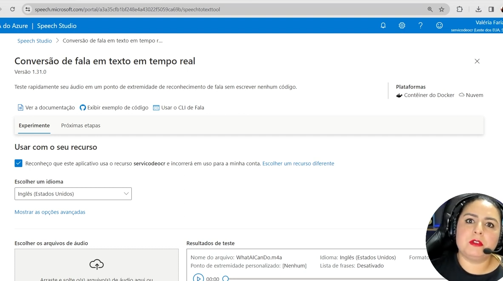
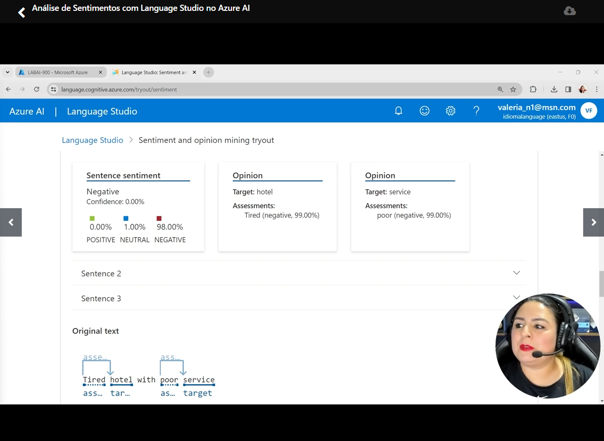

# Análise de Sentimentos com Azure AI

## Introdução

Este repositório foi criado como parte do desafio da [DIO](https://www.dio.me/) e tem como objetivo praticar e aprofundar o uso das ferramentas Azure Speech Studio e Language Studio, focando na análise de fala e linguagem natural

## Resumo

Nos últimos anos, a evolução da inteligência artificial aplicada à linguagem e voz deixou de ser apenas um experimento acadêmico e passou a impactar diretamente negócios e experiências humanas.  
No ecossistema da Microsoft, duas ferramentas se destacam nesse cenário: **Speech Studio** e **Language Studio**, ambas dentro da plataforma **Azure AI**.

Mais do que apenas recursos técnicos, essas soluções representam um **caminho prático para aproximar máquinas e pessoas**, criando interações mais naturais.

## Aprendizados

Trabalhar com essas ferramentas deixa algumas lições claras:

- A tecnologia é acessível e não exige grande profundidade técnica para o início é bem intuitivo.
- O ganho real vem da **integração com processos de negócio**.
- Documentar experimentos é essencial para acumular conhecimento, pois há muita opção de aplicação.

## Speech Studio: a voz como interface

O **Speech Studio** possibilita que a fala seja transformada em texto e vice-versa, mas o valor vai além da transcrição literal.

- Reconhece sotaques e variações da fala com boa precisão.
- Permite personalizar vozes, adaptando-se a setores específicos (jurídico, saúde, educação).
- Possui uma interface acessível, ideal para prototipagem e experimentação rápida.

**Prática:** Aplicações em call centers inteligentes, acessibilidade digital e assistentes virtuais corporativos.

## Language Studio: compreensão de texto em escala

Enquanto o Speech lida com a voz, o **Language Studio** amplia a análise do **conteúdo escrito**.

- Detecta sentimentos (positivo, neutro, negativo).
- Identifica entidades relevantes, como nomes de empresas, locais e datas.
- Traduz textos, viabilizando soluções multilíngues.

**Prática:** Útil em chatbots, monitoramento de redes sociais e análise de feedback de clientes.

## Integração: do som ao significado

O verdadeiro potencial surge quando combinamos os dois estúdios.  
Um fluxo possível seria:

1. Capturar a fala do usuário.
2. Transcrever automaticamente.
3. Analisar o sentimento e extrair entidades.
4. Responder em texto ou em voz com naturalidade.

Esse encadeamento abre espaço para **assistentes virtuais mais empáticos** ou sistemas de suporte que ajustam a resposta conforme a emoção detectada no cliente.

---

## Evidências

- Conversão de voz para texto
  

- Análise de sentimento de um texto
  

---

## Conclusão

O **Azure AI**, através do Speech Studio e do Language Studio, mostra como a IA aplicada à linguagem já é parte do presente.  
Mais do que entender ou transcrever palavras, essas ferramentas permitem **interpretar sentimentos, contextos e intenções**.

O futuro parece apontar para soluções em que a máquina não apenas compreende o que foi dito, mas **como foi dito** e responde de forma cada vez mais próxima da interação humana.

## Recursos para exploração

- [Speech Studio - Documentação Oficial](https://learn.microsoft.com/azure/cognitive-services/speech-service/)
- [Language Studio - Documentação Oficial](https://learn.microsoft.com/azure/cognitive-services/language-service/)
